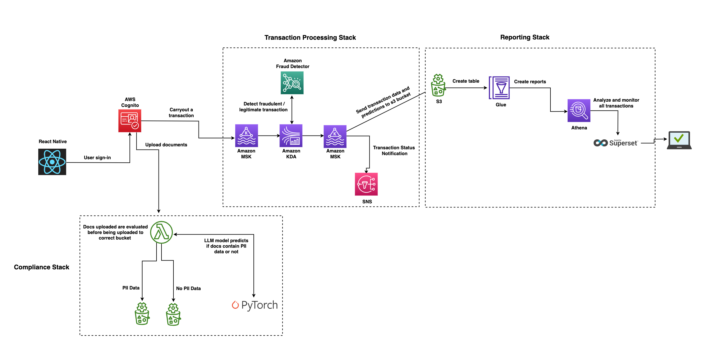

# Serverless Fraud and Compliance at Scale

## Architecture



## Assumptions
Basic knowledge of:
- Git
- Javascript
- Python
- AWS (GCP, AZURE…)


## Compliance Stack
- Install Serverless Framework:

```
cd backend && cd cs-service
```

```
npm install -g serverless

```


- On `serverless.yml` file, use the same service name - `cs-service` or create a new one
- Replace the `AWS_S3_BUCKET_NAME` variable with the name you plan to use
- Similarly, replace the `AWS_S3_BUCKET_NAME` on the `resources/data-lake.yml` file with a different name from the s3 bucket named on `serverless.yml`

- Firstly, run this aws command to retrieve AWS_ACCOUNT_ID:

  
```
aws sts get-caller-identity --query 'Account' --output text
```

- Build docker image for LLM and push to AWS ECR by running the following commands:

```
docker build -t llm-ftdc .
```

```
aws ecr get-login-password --region us-east-1 | docker login --username AWS --password-stdin AWS_ACCOUNT_ID.dkr.ecr.us-east-1.amazonaws.com
```

```
aws ecr create-repository --repository-name llm-ftdc --image-scanning-configuration scanOnPush=true --image-tag-mutability MUTABLE --region us-east-1
```

```
docker tag llm-ftdc AWS_ACCOUNT_ID.dkr.ecr.us-east-1.amazonaws.com/llm-ftdc:latest
```

```
docker push AWS_ACCOUNT_ID.dkr.ecr.us-east-1.amazonaws.com/llm-ftdc:latest
```

**More updates coming soon…**
